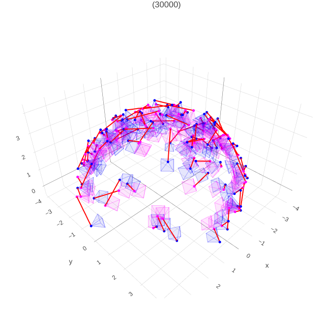
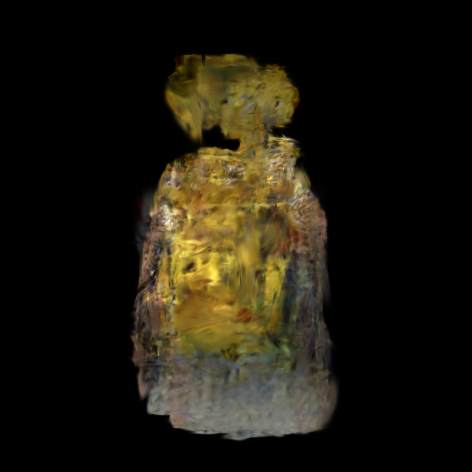
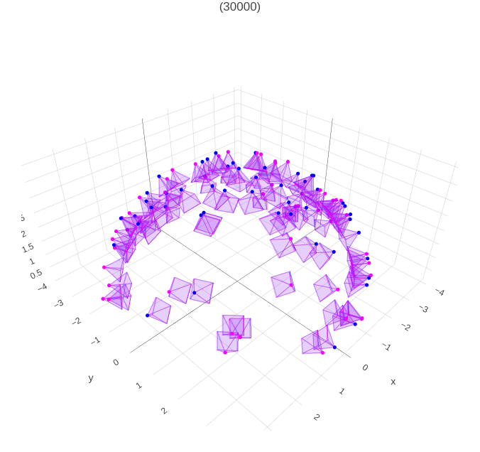
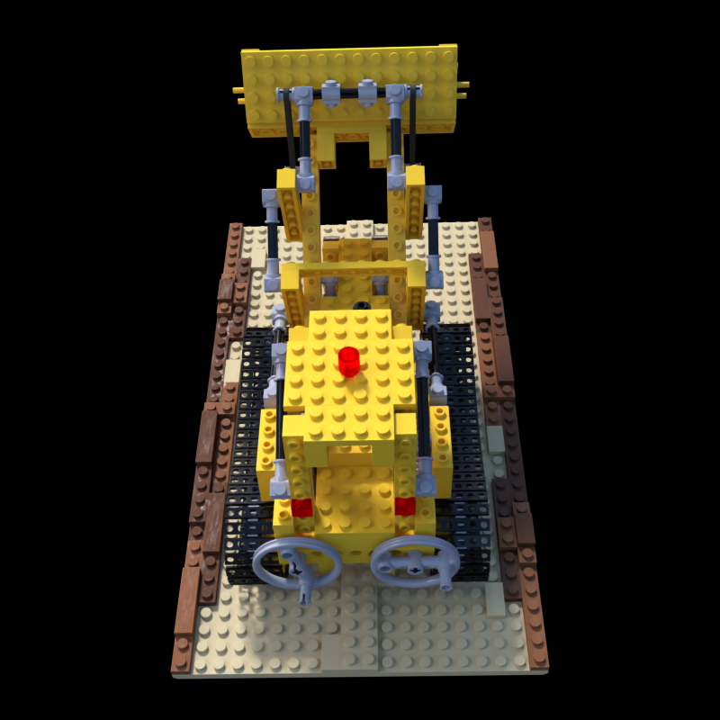

# Self-Calibrating Gaussian Splatting for Large Field of View Reconstruction

***

## Cloning the Repository

The repository contains submodules. Please clone with:

```bash
git clone --depth 1 git@github.com:denghilbert/Bundle-Adjusting-Gaussian-Splatting.git --recursive
```

***

## Setup Environment

Our test environment:

* Ubuntu 22.04 with NVCC 11.8 and g++ 11.4.0
* RTX 4090 (sm_89 architecture, CUDA 11.8 and later)
* RTX 3090, A5000, A6000 (sm_86 architecture, CUDA 11.1 and later)

We recommend using NVCC 11.8 or later than that.

The installation of SIBR viewers can follow [original 3dgs repo](https://github.com/graphdeco-inria/gaussian-splatting?tab=readme-ov-file#interactive-viewers).

Our method is based on Conda package and environment management:

```shell
conda create -n self-cali python=3.10
conda activate self-cali
pip install torch==2.0.0 torchvision==0.15.1 torchaudio==2.0.1 --index-url https://download.pytorch.org/whl/cu118
pip install tqdm plyfile imageio easydict FrEIA wandb matplotlib ipdb termcolor visdom selenium pywavefront

# install customized rasterizer
cd 3dgs-pose
pip install .
cd ..
# install lib
cd simple-knn
pip install .
cd ..
```

***

For a quick start, we provide [example datasets](https://drive.google.com/file/d/1sJOX12DVG2LvVy3ZYLj28B7-SNBqtagV/view?usp=sharing).

## Running

### Intrinsic and Extrinsic Optimization

To run pose optimization with visualization, we first need to run visdom and then train 3D Gaussians, the visualization will run global pose alignment:

```shell
# run visdom with a port
screen -S vis
visdom -port 8600
```

```shell
# perturb poses without optimization
python train.py -s lego/ -m output/lego_woopt --r_t_noise 0.15 0.15 1.0 --test_iterations 7000 15000 30000 --save_iterations 7000 15000 30000 --iterations 30000 --eval --r_t_lr 0.01 0.02 --init_type random --vis_pose --wandb_project_name release_code --wandb_mode online
# optimize poses
python train.py -s lego/ -m output/lego_opt --r_t_noise 0.15 0.15 1.0 --test_iterations 7000 15000 30000 --save_iterations 7000 15000 30000 --iterations 30000 --eval --r_t_lr 0.01 0.02 --init_type random --opt_cam --vis_pose --wandb_project_name release_code --wandb_mode online
```

We can also jointly optimize extrinsic and intrinsic:

```shell
python train.py -s lego/ -m output/lego_opt --r_t_noise 0.15 0.15 1.0 --test_iterations 7000 15000 30000 --save_iterations 7000 15000 30000 --iterations 30000 --eval --r_t_lr 0.01 0.02 --init_type random --opt_cam --vis_pose --wandb_project_name release_code --wandb_mode online --opt_intrinsic
```

Optimization viewer:
<p align="center">
    
    
    
    
</p>
Note: the evaluation numbers look odd since I didn't evaluate on optimized cameras. I will fix this in the future, but the results above show the capability of optimizing from noise poses

### Distortion Modeling

To run vanilla-GS reconstruction without any optimization:

```shell
python train.py -s example_datasets/single_planar/cube/ -m output/cube_init_only --r_t_noise 0.0 0.0 1. --test_iterations 3000 10000 20000 30000 --save_iterations 3000 10000 20000 30000 --checkpoint_iterations 3000 10000 20000 30000 --iterations 30000 --eval --r_t_lr 0.002 0.002 --control_point_sample_scale 16 --wandb_project_name release_code --wandb_mode online
```

We can also initialize distortion network with predictions from COLMAP and fix the network:

```shell
python train.py -s example_datasets/single_planar/cube/ -m output/cube_init_only --r_t_noise 0.0 0.0 1. --test_iterations 3000 10000 20000 30000 --save_iterations 3000 10000 20000 30000 --checkpoint_iterations 3000 10000 20000 30000 --iterations 30000 --eval --r_t_lr 0.002 0.002 --control_point_sample_scale 16 --extend_scale 10000 --opt_distortion --outside_rasterizer --flow_scale 2. 2. --iresnet_lr 1e-7 --wandb_project_name release_code --wandb_mode online --port 11112 --opacity_reset_interval 100000 --densify_until_iter 100000 --iresnet_opt_duration 30000 30001
```

Finally, our method optimizes from an inaccurate COLMAP prediction:

```shell
python train.py -s example_datasets/single_planar/cube/ -m output/cube --r_t_noise 0.0 0.0 1. --test_iterations 3000 10000 20000 30000 --save_iterations 3000 10000 20000 30000 --checkpoint_iterations 3000 10000 20000 30000 --iterations 30000 --eval --r_t_lr 0.002 0.002 --control_point_sample_scale 16 --extend_scale 10000 --opt_distortion --outside_rasterizer --flow_scale 2. 2. --iresnet_lr 1e-7 --wandb_project_name release_code --wandb_mode online --port 11112 --opacity_reset_interval 100000 --densify_until_iter 100000 --iresnet_opt_duration 0 7000
```

We can also apply cubemap sampling to support wider FOV cameras:

```shell
python train.py -s example_datasets/cubemap/hilbert_largefov/ -m output/hilbert --r_t_noise 0.0 0.0 1. --test_iterations 7000 15000 20000 --save_iterations 7000 15000 20000 --checkpoint_iterations 7000 15000 20000 --iterations 20000 --r_t_lr 0.002 0.002 --cubemap --no_init_iresnet --wandb_project_name release_code --wandb_mode online --opacity_reset_interval 20000 --densify_until_iter 20000 --port 21112 --eval --iresnet_opt_duration 0 7000 --control_point_sample_scale 8 --iresnet_lr 1e-8 --mask_radius 507
```

We also provide the [scripts](https://github.com/denghilbert/Bundle-Adjusting-Gaussian-Splatting/tree/main/script) used to train all scenes.

***

## Data Preparation

After taking several images, all you need to do is structure the images like this:

```
<location>
|---input
    |---<image 0>
    |---<image 1>
    |---...
```

And run:

```shell
# run colmap
python convert.py --source_path path_to_your_data/<location> --colmap_executable /opt/homebrew/bin/colmap --camera OPENCV_FISHEYE
cd path_to_your_data/<location>
mkdir fish
cp -r input fish
cp -r distorted/sparse fish
mv fish/input fish/images
```

The final directory of a single scene should look like this where `<location>/fish/images` contains distorted images and `<location>/images` contains perspective ones.

```
<location>
├── fish
│   ├── images
│   │   ├── 000.jpg
│   │   ├── 001.jpg
│   │   ├── ...
│   └── sparse
│       └── 0
│           ├── cameras.bin
│           ├── images.bin
│           ├── points3D.bin
├── images
│   ├── 000.jpg
│   ├── 001.jpg
│   ├── ...
└── sparse
    └── 0
        ├── cameras.bin
        ├── images.bin
        ├── points3D.bin
        └── points3D.ply
```

